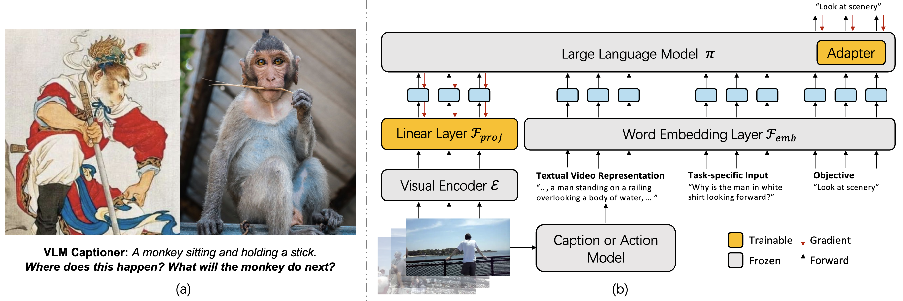

# Vamos: Versatile Action Models for Video Understanding
This repository contains the official implementation for the paper [Vamos: Versatile Action Models for Video Understanding](https://arxiv.org/abs/2311.13627), including codes to train Vamos on Video QA tasks (NeXT-QA, IntentQA, and Perception Test) and EgoSchema zero-shot evaluation.

<div align="center">
  
</div>

## Setup
To install requirements, run:
```
git clone git@github.com:brown-palm/Vamos.git
cd Vamos
conda create -n vamos python=3.8
conda activate vamos
sh setup.sh
```

## Video QA Dataset & LLaMA Preparation to Train Vamos
All the codes for training Vamos for video QA tasks are under the `finetune` folder.
```
cd finetune
mkdir pretrained
mkdir data
```
You can download our preprocessed datasets (NExT-QA, IntentQA, Perception Test) at [here](https://drive.google.com/file/d/1srpMKshuNZV0w9wz2QkX9w-t55RU0C5j/view?usp=sharing). Put them in ```data```. Also, you can download original LLaMA at [here](https://github.com/facebookresearch/llama/tree/llama_v1), and put the checkpoint in ```pretrained```.

```
finetune/pretrained
    |─ llama
    |  |─ 7B
    |  |   |─ consolidated.00.pth
    |  |   └─ params.json
    |  └─ tokenizer.model
    |   :
    |─ llama2
    |   :
    └─ llama3
        :

finetune/data
   |─ nextqa
   |   |─ train.csv
   |   |─ val.csv
   |   |─ test.csv
   |   |─ llava_v15_7b_n6.json
   |   |─ llava_v15_13b_n6.json
   |   └─ clipvitl14.pth
   |─ intentqa
   |   |─ train.csv
   |   |─ val.csv
   |   |─ test.csv
   |   |─ blip2_n6.json
   |   └─ clipvitl14.pth
   └─ ptest
       |─ train.csv
       |─ val.csv
       |─ llava_v15_7b_n6.json
       |─ llava_v15_13b_n6.json
       └─ clipvitl14.pth
```

## Training Vamos
After preparing the datasets and LLaMA weights, excute the following codes under `finetune` folder. For pure visual representation, 40G A100/A6000 is recommended, for text and text + vision, 80G A100 is recommended. `--batch_size` and `--accum_iter` can be adjusted according to GPU number and memory size.

### NExT-QA

```
# text representation
torchrun --rdzv_endpoint 127.0.0.1:1234 --nproc_per_node 4 train.py --model 8B --max_seq_len 1200 --batch_size 2 --epochs 10 --warmup_epochs 2 --bias 3.5 --tau 100. --max_feats 6 --dataset nextqa --blr 9e-2 --weight_decay 0.14 --accum_iter 8 --use_cap --llama_model_path ./pretrained/llama3/ --output_dir ./checkpoint/nextqa_cap_ep10_llama3 --project_name nextqa

# visual representation
torchrun --rdzv_endpoint 127.0.0.1:1234 --nproc_per_node 4 train.py --model 8B --max_seq_len 128 --batch_size 8 --epochs 5 --warmup_epochs 2 --bias 3.5 --tau 100. --max_feats 6 --dataset nextqa --blr 9e-2 --weight_decay 0.14 --accum_iter 2 --use_vis --llama_model_path ./pretrained/llama3/ --output_dir ./checkpoint/nextqa_vis_ep5_llama3 --project_name nextqa

# vision + text
torchrun --rdzv_endpoint 127.0.0.1:1234 --nproc_per_node 4 train.py --model 8B --max_seq_len 1200 --batch_size 2 --epochs 10 --warmup_epochs 2 --bias 3.5 --tau 100. --max_feats 6 --dataset nextqa --blr 9e-2 --weight_decay 0.14 --accum_iter 8 --use_cap --use_vis --llama_model_path ./pretrained/llama3/ --output_dir ./checkpoint/nextqa_vis_cap_ep10_llama3 --project_name nextqa --alter_train
```

### IntentQA

```
# text representation
torchrun --rdzv_endpoint 127.0.0.1:1234 --nproc_per_node 4 train.py --model 8B --max_seq_len 512 --batch_size 8 --epochs 5 --warmup_epochs 2 --bias 3.5 --tau 100. --max_feats 6 --dataset intentqa --blr 9e-2 --weight_decay 0.14 --accum_iter 2 --use_cap --llama_model_path ./pretrained/llama3/ --output_dir ./checkpoint/intentqa_cap_ep5_llama3 --project_name intentqa

# visual representation
torchrun --rdzv_endpoint 127.0.0.1:1234 --nproc_per_node 4 train.py --model 8B --max_seq_len 128 --batch_size 8 --epochs 5 --warmup_epochs 2 --bias 3.5 --tau 100. --max_feats 6 --dataset intentqa --blr 9e-2 --weight_decay 0.14 --accum_iter 2 --use_vis --llama_model_path ./pretrained/llama3/ --output_dir ./checkpoint/intentqa_vis_ep5_llama3 --project_name intentqa

# vision + text
torchrun --rdzv_endpoint 127.0.0.1:1234 --nproc_per_node 4 train.py --model 8B --max_seq_len 1200 --batch_size 8 --epochs 10 --warmup_epochs 2 --bias 3.5 --tau 100. --max_feats 6 --dataset intentqa --blr 9e-2 --weight_decay 0.14 --accum_iter 2 --use_cap --use_vis --llama_model_path ./pretrained/llama3/ --output_dir ./checkpoint/intentqa_vis_cap_ep10_llama3 --project_name intentqa --alter_train
```

### Perception Test

```
# text representation
torchrun --rdzv_endpoint 127.0.0.1:1234 --nproc_per_node 4 train.py --model 8B --max_seq_len 1200 --batch_size 2 --epochs 10 --warmup_epochs 2 --bias 3.5 --tau 100. --max_feats 10 --dataset ptest --blr 9e-2 --weight_decay 0.14 --accum_iter 8 --use_cap --llama_model_path ./pretrained/llama3/ --output_dir ./checkpoint/ptest_cap_ep10_llama3 --project_name ptest

# visual representation
torchrun --rdzv_endpoint 127.0.0.1:1234 --nproc_per_node 4 train.py --model 8B --max_seq_len 256 --batch_size 8 --epochs 5 --warmup_epochs 2 --bias 3.5 --tau 100. --max_feats 10 --dataset ptest --blr 9e-2 --weight_decay 0.14 --accum_iter 2 --use_vis --llama_model_path ./pretrained/llama3/ --output_dir ./checkpoint/ptest_vis_ep5_llama3 --project_name ptest

# vision + text
torchrun --rdzv_endpoint 127.0.0.1:1234 --nproc_per_node 4 train.py --model 8B --max_seq_len 1200 --batch_size 2 --epochs 10 --warmup_epochs 2 --bias 3.5 --tau 100. --max_feats 10 --dataset ptest --blr 9e-2 --weight_decay 0.14 --accum_iter 8 --use_cap --use_vis --llama_model_path ./pretrained/llama3/ --output_dir ./checkpoint/ptest_vis_cap_ep10_llama3 --project_name ptest --alter_train
```

## Pretrained checkpoints
Pretrained Vamos-LLaMA3 checkpoints are provided: [NeXT-QA](https://drive.google.com/file/d/1MXBufOEfz-BXQqZ0z6DlQImvVUZzsk0X/view?usp=drive_link), [IntentQA](https://drive.google.com/file/d/1Ibd8NUH6YrBAu8ACokJUfu84CkR6h4ZG/view?usp=drive_link), and [Perception Test](https://drive.google.com/file/d/1340nI717sogYLrLkSI6eEiBuU97qAqWT/view?usp=drive_link).

## Evaluation
From the training command, simply replace ```train.py``` to ```eval.py``` and add ```--resume your/checkpoint.pth```, for example:


```
# Eval NeXT-QA with pure text representation
torchrun --rdzv_endpoint 127.0.0.1:1234 --nproc_per_node 4 eval.py --model 8B --max_seq_len 1200 --batch_size 2 --epochs 10 --warmup_epochs 2 --bias 3.5 --tau 100. --max_feats 10 --dataset nextqa --blr 9e-2 --weight_decay 0.14 --accum_iter 8 --use_cap --llama_model_path ./pretrained/llama3/ --output_dir ./checkpoint/nextqa_cap_ep10_llama3 --project_name nextqa --resume checkpoint/nextqa_cap_13b_llama3.pth
```

## Acknowledgements

This repo is built upon [LLaMA-Adapter](https://github.com/OpenGVLab/LLaMA-Adapter) and [Flipped-VQA](https://github.com/mlvlab/Flipped-VQA).

## Citations
```
@misc{wang2023vamos,
        title={Vamos: Versatile Action Models for Video Understanding}, 
        author={Shijie Wang and Qi Zhao and Minh Quan Do and Nakul Agarwal and Kwonjoon Lee and Chen Sun},
        year={2023},
        eprint={2311.13627},
        archivePrefix={arXiv},
        primaryClass={cs.CV}
  }
```

